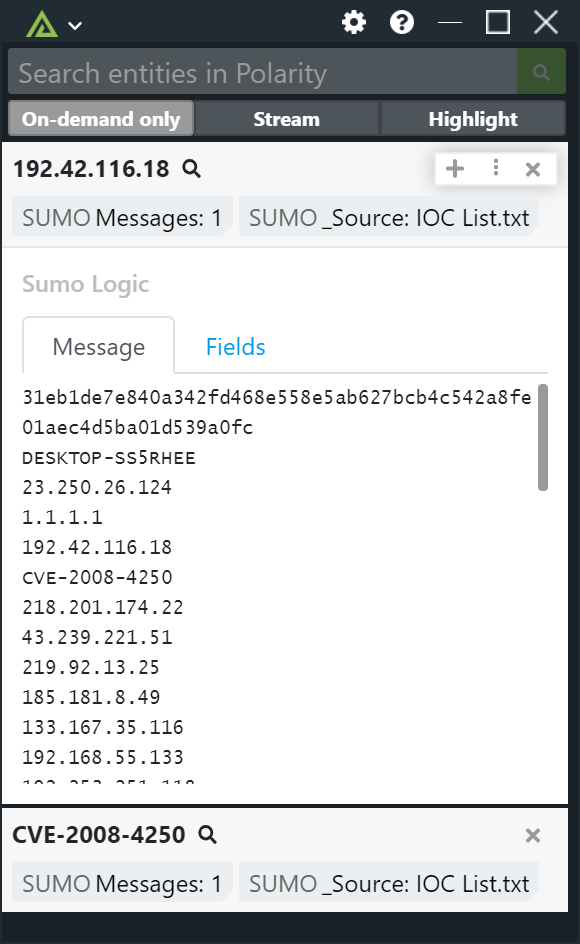

# Polarity Sumo Logic Integration

Sumo Logic, Inc. is a cloud-based machine data analytics company focusing on security, operations and BI use cases. It provides log management and analytics services that leverage machine-generated big data to deliver real-time IT insights.  This integration will run the provided search query and return the first 10 results.



To learn more about Sumo Logic, please visit: https://www.sumologic.com/

## Sumo Logic Integration Options

## Access ID

A valid Sumo Logic access Id. An access Id can be generated in your Sumo Logic dashboard.

## Access Key

A valid Sumo Logic access key associated with the provided Access ID. An access Key can be generated in your Sumo Logic dashboard (make sure to save this somewhere, it can only be viewed once).

## Sumo Logic API Deployment Location

Your Sumo Logic deployment endpoint location. For more information, please see: https://help.sumologic.com/APIs/General-API-Information/Sumo-Logic-Endpoints-and-Firewall-Security

## Query

The search expression. 

## Search Window

The search window for your search

## Time zone for log search parameters

The time zone if from/to is not in milliseconds. See this Wikipedia article - https://en.wikipedia.org/wiki/List_of_tz_database_time_zones, for a list of valid time zone codes.

## Search By Receipt Time

Define as true to run the search using receipt time which is the order that Collectors received the messages. By default, searches do not run by receipt time.

# Sumo Logic Search Queries

You can find documentation on the Sumo Logic Query Language here: https://help.sumologic.com/05Search/Search-Query-Language

In general, queries that work through the Sumo Logic web interface can also be used in this integration.

The default query will default to creating a job that will include ALL messages containing the entity that the user is searching. Defaults to: '\_sourceName =\* and {{entity}}'

Example requests:

```
 "query": "* | parse "GET * " as {{entity}}
 | count by {{entity}}
 | top 10 {{entity}} by _count"
```
If a user is searching the IP, 1.2.3.4 - then, it will replace the templated entity value.

```
 "query": "* | parse "GET * " as {{1.2.3.4}}
 | count by {{1.2.3.4}}
 | top 10 {{1.2.3.4}} by _count"
```

# Troubleshooting

## Installation Instructions

Installation instructions for integrations are provided on the [PolarityIO GitHub Page](https://polarityio.github.io/).

## Polarity

Polarity is a memory-augmentation platform that improves and accelerates analyst decision making. For more information about the Polarity platform please see:

https://polarity.io/
