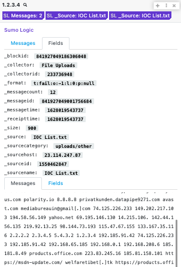

# Polarity Sumo Logic Integration

Sumo Logic, Inc. is a cloud-based machine data analytics company focusing on security, operations and BI use cases. It provides log management and analytics services that leverage machine-generated big data to deliver real-time IT insights.



To learn more about Sumo Logic, please visit: https://www.sumologic.com/

## Sumo Logic Integration Options

## Access ID

A valid Sumo Logic access Id. An access Id can be generated in your Sumo Logic dashboard.

## Access Key

A valid Sumo Logic access key. An access Key can be generated in your Sumo Logic dashboard(make sure to save this somewhere, it can only be viewed once).

## Creating a Sumo Logic Job

Sumo Logic Query Language docs: https://help.sumologic.com/05Search/Search-Query-Language

The query will default to creating a job that will include ALL messages containing the entity that the user is searching. Defaults to: '\_sourceName =\* and {{entity}}'

- Query
  The query along with a time range and timezone must be executed as valid JSON. The search query can use the templated `{{entity}}` variable, which will be set as the entity the user is searching.

- timeRange
  The search window for your search. This option defaults to search the last 3 months.

- timeZone
  The time zone if from/to is not in milliseconds. See this Wikipedia article - https://en.wikipedia.org/wiki/List_of_tz_database_time_zones, for a list of time zone codes.

- apiDeployment
  Your Sumo Logic deployment endpoint location. For more information, please see: https://help.sumologic.com/APIs/General-API-Information/Sumo-Logic-Endpoints-and-Firewall-Security

- byReceiptTime
  Define as true to run the search using receipt time. By default, searches do not run by receipt time.

```
Example requests:

{
 "query": "* | parse "GET * " as {{entity}}
 | count by {{entity}}
 | top 10 {{entity}} by _count"
   "from": "2019-05-03T12:00:00",
  "to": "2019-05-03T12:05:00",
  "timeZone": "IST",
  "byReceiptTime": true
{

If a user is searching the IP,  1.2.3.4 - then, it will replace the templated entity value.

{
 "query": "* | parse "GET * " as {{1.2.3.4}}
 | count by {{1.2.3.4}}
 | top 10 {{1.2.3.4}} by _count"
   "from": "2019-05-03T12:00:00",
  "to": "2019-05-03T12:05:00",
  "timeZone": "IST",
  "byReceiptTime": true
{
```

## Installation Instructions

Installation instructions for integrations are provided on the [PolarityIO GitHub Page](https://polarityio.github.io/).

## Polarity

Polarity is a memory-augmentation platform that improves and accelerates analyst decision making. For more information about the Polarity platform please see:

https://polarity.io/
